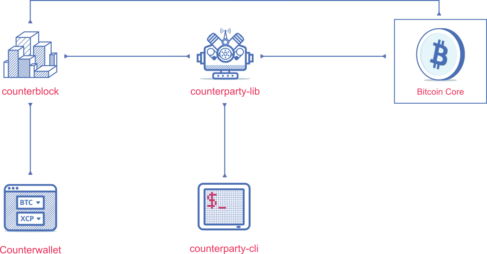

In the figure below you can see how all Counterparty platform components interact with each other.

## counterparty-server

`counterparty-server` is the name for the combination of `counterparty-lib` and `counterparty-cli`. It serves as the reference client for Counterparty, and implements support for the core Counterparty protocol via a provided REST API and command line interface.

## counterblock

`counterblock` provides additional services (required by counterwallet and potentially other services) beyond those offered in the API provided by `counterparty-server`. It features a full-fledged JSON RPC-based API, and has an extensible architecture to support custom plugins.

## Counterwallet

Counterwallet is a web wallet for Bitcoin (BTC) and Counterparty (XCP). It is being actively developed and currently implements most Counterparty features, such as:

* Fully functional wallet for BTC, XCP, and user-created tokens
* Peer-to-peer asset trading with algorithmic order matching (XCP, other assets)
* Custom asset creation
* Betting
* Broadcasting data on the Bitcoin Blockchain
* Multisig
* Offline (Armory) transactions

## armory_utxsvr

A service used by counterblock with Counterwallet to support Offline Armory transactions. This service requires Armory itself.
