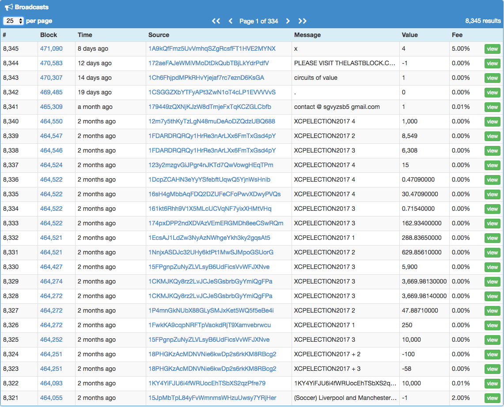
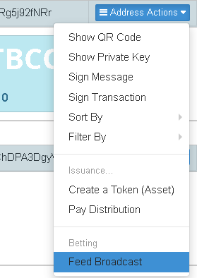
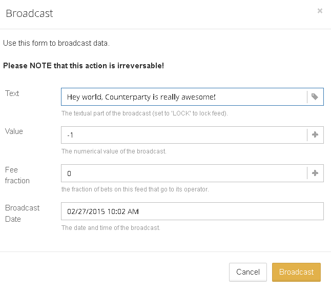
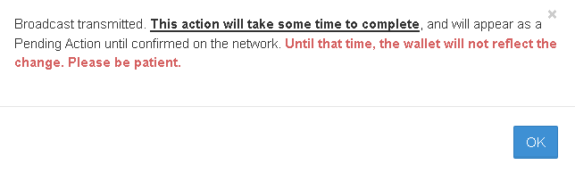

Counterparty lets you publish text and data on the Bitcoin blockchain, this is called a 'broadcast'. This is useful for proof-of-publication, notary purposes, and creating betting feeds and oracles. This information is timestamped (as blocks), freely browseable and permanently stored on the Bitcoin blockchain. You can view and search broadcasts on a block explorer such as [XChain](https://xchain.io/broadcasts):

### How to publish a broadcast in Counterwallet

**Click address actions and Feed Broadcast.**

**Enter the text or data you want to publish on the BTC blockchain. Note: The fields for fee and value are only used when creating a betting feed, you can leave the default values if you only wish to publish information.**

**Note: The fields for fee and value are only used when creating a betting feed, you can leave the default values if you only wish to publish information. "Broadcast Date" (date picker) has no effect here (because timestamping is done by bitcoin miners) and may be removed in a future version.**

**Wait for the Bitcoin network to confirm your broadcast, and it will be visible online.**

