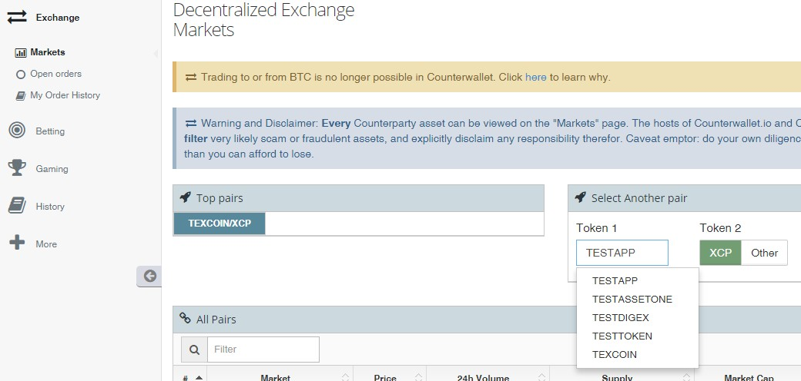
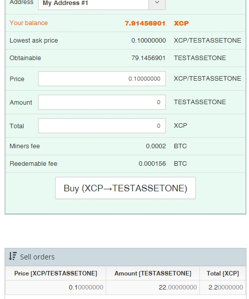
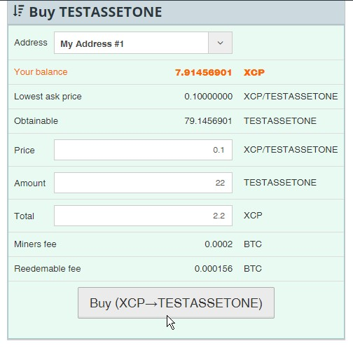

This tutorial takes you through the process of buying and consequently selling a Counterparty-issued asset (or token/coin) from Counterwallet. By "Counterparty-issued" we mean "issued on the Counterparty platform by its users" as the Counterparty Project does not issue assets (XCP is the only asset that was issued by the Project).

First, let's summarize how things work:

1. All Counterparty assets can be traded on the Counterparty Decentralized Exchange and most Counterwallet sellers denominate their asset in XCP.  It is possible, but rare, to sell your asset A for another asset B, although that may be interesting in some cases. Some main advantages of decentralized crypto-exchanges are obviously decentralization (no counterparty risk) and a lower cost of filled orders.

2. Some popular Counterparty-listed assets are available on traditional (centralized) crypto-exchanges such as Poloniex and MasterXchange where they are usually available denominated in BTC. This article covers only the DEx, but just so that you know the same asset can be traded on the DEx (usually denominated in XCP) and externally (usually denominated in BTC). Some advantages of centralized crypto-exchanges include the speed of trading and usually a better liquidity. 

3. In order to buy an XCP-denominated asset, the user needs to complete the following steps:

a) Create a wallet if you already don't have one (this one is easy, but make absolutely sure to write down your pass phrase). In case you'd like to practice first, there is a testnet (a network with "fake" (test) assets) wallet ([link](https://testnet.counterwallet.co/)) where you can open two wallets and practice without any risk or cost - see [What do I need to start using Counterwallet](https://counterpartytalk.org/t/what-do-i-need-to-start-using-counterwallet/1156). It is simpler, more reliable, faster and more secure to use Counterwallet in the private browsing mode (in Chrome, CTRL+SHIFT+N, in Firefox, CTRL+SHIFT+P) which disables extensions/addons (see [this for additional security-related](https://counterpartytalk.org/t/what-precautions-and-best-practices-can-i-use-for-counterwallet/1165) ideas).

b) Buy some XCP on a and send XCP [and a small amount of BTC](https://counterpartytalk.org/t/why-do-i-need-small-amounts-of-bitcoin-to-do-things/1142) (e.g. 0.01) to your wallet address.

c) Understand the fees (see [What is the difference between Total and Real Estimated Total when placing an order?](https://counterpartytalk.org/t/what-is-the-difference-between-total-and-real-estimated-total-when-placing-an-order/1178) and [What is the difference between 'miner's fee' and 'redeemable fee'?](https://counterpartytalk.org/t/what-is-the-difference-between-miners-fee-and-redeemable-fee/1188)), and [how to recognize fake (fraudulent) assets](https://counterpartytalk.org/t/how-to-recognize-fraudulent-counterparty-assets/1170))

d) Place a buy order on the DEx. If your offer gets matched within the duration of your order, your it will be settled. Otherwise it'll fail.  In case you change your mind or prices change, you can **cancel **your order before it expires (see [When is an order considered "active" and how can I cancel it?](https://counterpartytalk.org/t/when-is-a-dex-order-considered-active-and-how-can-i-cancel-it/1180))

Now that we covered the basics, let's walk through buy and sell scenarios.

Before we move on let's remind ourselves that the default order validity (which can be changed in Counterwallet **Settings** and which does not persist between logons) is 1000 blocks of the Bitcoin blockchain, so if you trade in unstable assets you may want to change that to a lower value or even switch to a centralized crypto-exchange where it normally doesn't cost anything to place (and cancel) an order. See KB articles under 3d (above) for additional details.

### Buy

In Counterwallet's left-hand menu find **Exchange &gt; Markets**. If you're after a popular asset, you may already see it among **Top Pairs**. Make sure you get the correct asset name(s).

If not, move to the right and under **Select Another Pair **start typing the asset (token) name you're interested in. As you type Counterwallet will list available assets to save you time. Default unit of denomination is **XCP**, but you can select **Other **to enter another and as we mentioned above it is entirely possible that someone is selling WOOD for WATER. In that case you'd need have some WATER to buy WOOD and then you'd enter WOOD under **Token 1** and WATER under **Token 2**.  On a DEx level top assets (and their recent price trends) can be seen under **More &gt; Top Assets**.

Here we keep it simple and look for TESTASSETONE/XCP.

  

Once you click on TESTASSETONE, you will see the market. If it's any liquid, you'll see some buy and sell orders. We're buying so we're looking for Sell orders. At the very bottom of the screen we can see one sell offer: somebody is selling 22 TESTASSETONE in exchange for 2.2 XCP.  

  

If you're happy with that price, simply click on it and Counterwallet will populate your Buy Order form. Make sure the price is acceptable because matched orders cannot be cancelled! (It is not rare to hear that someone paid 0.001 for an asset that normally costs 0.0001.)

A populated buy form can be modified (**Price, Amount**). Visually inspect all fields (especially if **Total** is a large number) to make sure one last time and then press the Buy button.

    

Now your order will remain valid until it's matched, cancelled or expired (whichever comes faster - see related KB mentioned under 3d, above). 

Orders can be cancelled in two places - in **Exchange &gt; Open Orders **and on the trading page for each asset pair where you have placed orders. The first location gives you a quicker way to see all your pending orders and cancel several on the same page. Orders can be partially matched and filled.

You can monitor your order status using [https://xchain.io/](https://xchain.io/).

### Sell

Selling is executed the same way as buying, just in the opposite direction, so please refer to Buy section for details.

The key part here is to carefully enter the price and quantity. Just because someone is offering 0.001 for your token that's normally selling for 0.01 doesn't mean you should click on their offer to auto-populate Sell order form with their values. If you are selling an asset that's also listed elsewhere (say, SJCX) you may want to check the price on other exchanges and see recently traded prices under **More &gt; Top Assets**.
