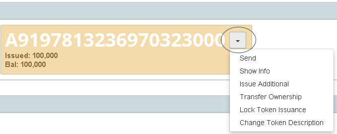
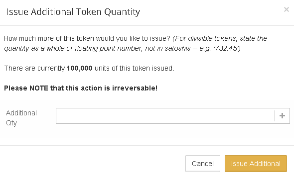
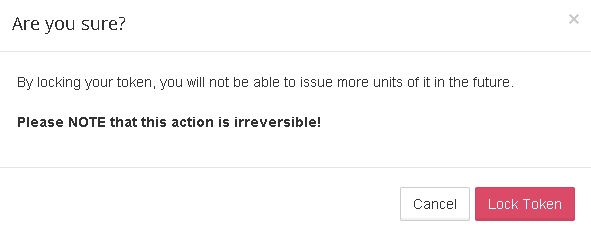
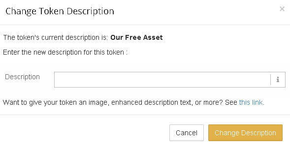
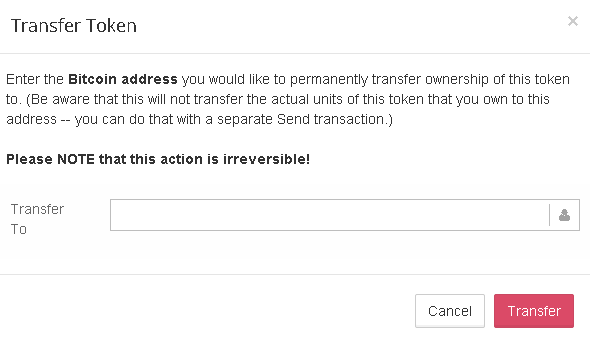

Once you have created a token, the address you have used will automatically be the owner of this token. This means that you will have access to certain token settings that can be changed. You can access these settings in Counterwallet by pressing the down arrow on the token's box. 

**With ownership of a token you can:**
* change the token description
* issue additional units of your token
* lock the token in order to permanently prevent more unit from being issued
* transfer ownership of the token

### Issue additional tokens 
If your token is not locked, you will be able to issue additional units of your token to increase supply. Click "Issue Additional" to do so. This action is irreversible, but tokens can be sent to an unspendable address to effectively 'destroy' them if needed.

### Lock your token
If you would like to create a verifiably finite token, you will have to lock your token to prevent more units from being issued. Click "Lock Token Issuance" to do so. This action is irreversible.

### Change description
You can change the description of your token as often as you like. This will be publicly viewble in the blockchain. If you would like to add images, and additional information in your description, click [here](../../basics/assets/enhanced-asset.md)

### Transfer ownership
You can transfer ownership, and therefore control over issuance and description, of your token. Please keep in mind this action takes some time, and is irreversible.

