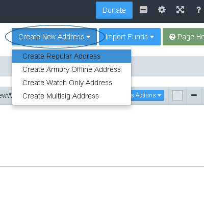
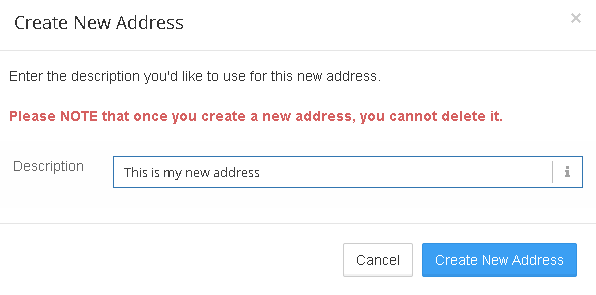
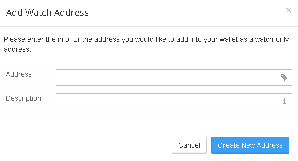
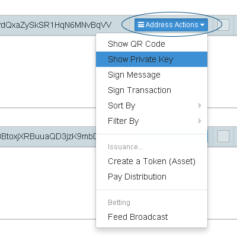
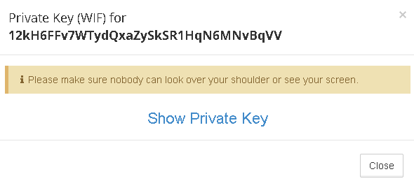
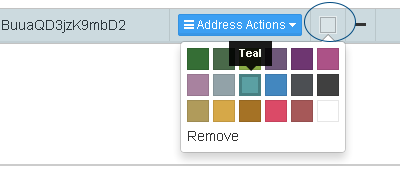
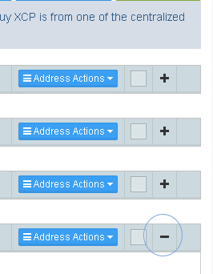

Counterwallet uses regular Bitcoin addresses, and you can create up to 20 in each wallet. If you need more, it is recommended and more secure if you create a new passphrase. 

**Counterwallet supports the creation of several different kinds of addresses:**

- Regular Address 
- [Armory Offline Address](create-armory-addresses.md) - compatible with the [Armory Wallet](https://bitcoinarmory.com/)
- Watch Only Address 
- Multi-signature address

### Creating a regular address

It is very simple to create addresses, just click "Create New Address".

You can create descriptions for your addresses. However, keep in mind that this information is not stored on the blockchain. Only you will be able to see the descriptions on your addresses.

### Creating a watch-only address

If you would like to monitor the BTC, XCP and asset balance of any address, you can create a watch-only address. This means that you will be able to see the balance, and create raw transactions. However, there is no private key associated with such addresses. This means that you will have to sign any transactions manually. This feature is useful for keeping track of your cold-storage coins.

### Displaying the private key of your address

If you would like to show the private key of an address, click address actions and show private key. If you cannot access Counterwallet for whatever reason, you can also generate your addresses and keys from your passphrase. For example, by using [this tool](https://blockscan.com/tool_generatekey). It's entirely client-side javascript. The source code is publicly visible, and you can even run it offline. 

Then you will be asked to confirm, to make sure nobody can see your screen. 

### Customizing the appearance of your addresses

Click the square next to address actions in order to set a color for your address.

Click the - or + respectively next to the square in order to minimize or maximize the display of your address, for more space on your screen.

