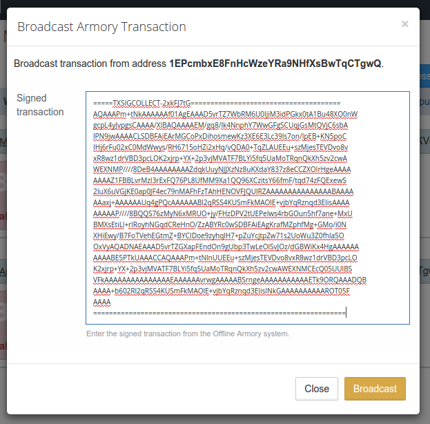

### 

**NOTE: This feature requires Armory 0.92.1 or later. As of this documentation update Counterwallet supports Armory 0.93.3.**

Set up an Armory offline wallet using the instructions from [here](https://bitcoinarmory.com/tutorials/armory-basics/). Additional video instructions are [here](https://www.youtube.com/watch?v=PGvrai3JxxI).

Create a Counterwallet account if you haven't already. Once logged in, go to Create New Address | Create Armory Offline Address:

Copy an address from the Armory offline wallet, and paste it into the dialog box that appears. Then, press the Create New Address button:

NOTE: The address you use must have at least one transaction being sent from it to be able to be used with Counterwallet. (This is because we require the public key to make transactions, which is only exposed when/if the address sends a transaction.)

Your address will then show up on your Counterwallet Balances page, with whatever assets happen to already be at the address:

With offline Armory addresses, you can do anything that you can do with a regular Counterwallet address (except for selling BTC on the Counterparty decentralized exchange).

For example, let's send some XCP that's already at our Armory address to the other address in our wallet, and see how that works. To do this, click on the Send option under the address's XCP balance, just like you would with another address, and enter the other address you wish to send to, then click Send:

Instead of seeing the transaction processed, you'll see a dialog that provides you with the unsigned transaction text:

As the dialog states, you'll need to copy this text down to a text file on a USB key, and take that to the offline computer running Armory.

On that offline computer, sign the transaction by going to Offline Transactions:

Then, load the transaction text file from the USB key, which the interface will say is unsigned:

Click on the Sign button, and enter your Armory wallet password, and the signed transaction will then be saved back to that same file:

Safely eject the USB key, then insert it into your computer running Counterwallet and open up the file containing the transaction you just signed in a text editor:

Copy down the text of the file to your clipboard. Then, back in Counterwallet, go to Address Actions | Broadcast Transaction for the armory address:

On the dialog that appears, paste in the signed transaction, and then click Broadcast:

If everything was done properly, you'll then see a dialog show that the broadcast was successful. The transaction should then be included in the blockchain by the next block, and the balance will then update (or whatever action you did will then take effect):

**Congratulations**, you successfully made your first offline transaction with Counterwallet! Enjoy the peace of mind gained from your valuable assets being in cold storage with this feature.
