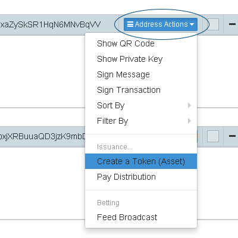
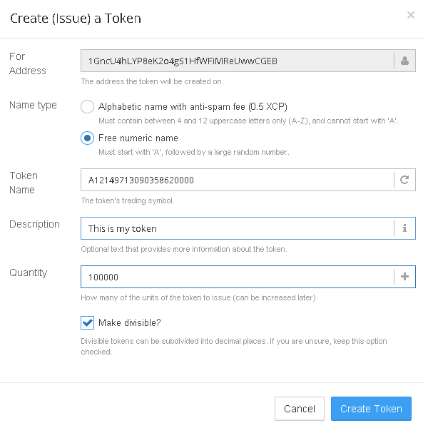

Counterwallet makes it possible for anyone to create tokens (also known as assets, coins, derivatives) that are then owned by the address they were issued from. Ownership enables you to issue more units of your token, lock the supply, change the description, and customize other settings. To learn more about token settings, click [here](change-token-settings.md).

Once the issuance is confirmed by the Bitcoin network, your tokens can be freely traded on the Counterwallet decentralized exchange against XCP and other tokens and (if you can convince them) centralized exchanges as well.

Tokens can be divisible or indivisible. Tokens that are not divisible will only exist in whole units (1,2,3,etc.) Divisible tokens support up to 8 decimal places. You can create as many tokens as you need. 

### There are two types of tokens:

**Alphabetical**

Alphabetical tokens (for example BACON) can be named, but must be between 4 and 12 uppercase letters and cannot start with A. To create an alphabetical token, you will need enough BTC for a transaction fee and 0.5 XCP on the address you are using. This is an anti-spam fee, which aims to reduce the amount of names a single individual can register without significant costs. The anti-spam fee is burned (destroyed).

**Numeric**

Numeric (or more precisely alphanumeric) tokens (for example A12149713090358620000) are free to register and only require a Bitcoin transaction fee (like all other Counterwallet actions) on the issuing address. If you only want to create and trade numeric tokens, you will not require any XCP. Numeric tokens must start with an "A".

### Creating a token is fairly simple:

* Log in to or create a wallet in Counterwallet
* Make sure your addresss has enough BTC for a transaction fee (currently 0.0002 BTC)
* If you want to create an alphabetical token, your address will also need 0.5 XCP for the anti-spam fee
* Click *"Address Actions"* on your address
* Click *"Create a Token/Asset"*

* Choose a type, description, quantity and divisiblity for your token. You can create a description for your token, which can either be plain text, a URL to your token’s official page, or a URL to a JSON file containing extended info. To learn more about extended info, look for information for Counterparty Enhanced Asset Info. It is also possible to register a token with an issuance of 0 units, as a placeholder.

