It is possible to trade on the Counterparty decentralized exchange directly inside Counterwallet. You can trade any token against any other token, including XCP. (Trading against BTC is planned for the near future.)

**Important:** But before you begin, please be aware this exchange inside Counterwallet is actually an interface to the Bitcoin network. This means that all tokens, buy, and sell orders are _all_ actually individual Bitcoin transactions. These transactions are then order matched by the protocol. This means that:

* **All buy and sell orders are automatically escrowed _in the Bitcoin blockchain_ itself until they are completed.** The Counterparty exchange is decentralized and peer-to-peer. This means that there is never a third party or middleman (such as a server administrator, traditional exchange, clearing house, or bank). This kind of trading is called 'trustless', because you do not have to trust anyone to handle your funds and complete your trade correctly.

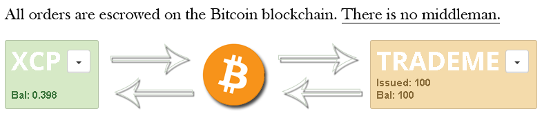

* Placing and cancelling orders requires the Bitcoin network to confirm these transactions, which may take some time.

* Each action requires a basic transaction fee (like any other regular Bitcoin transaction.)

* Some Counterwallet features may be restricted due to regulatory uncertainty in certain countries. This does not mean that they are disabled in the decentralized exchange. These features are simply hidden from the user interface by default to avoid legal issues. Like Bitcoin, Counterparty exists without international borders. So it is absolutely possible to use _any_ of the features in _any_ country by running your own copy of Counterwallet or Counterparty-cli, but please make 100% sure you are operating within the law before attempting this.

**Disclaimer:** 
All Counterwallet (and therefore Counterparty) actions are Bitcoin transactions. And because anyone can make a Bitcoin transaction, anyone can create a decentralized token. If this concept seems confusing, consider that Bitcoin functions entirely without a central bank. This is an identical 'free-for-all' scenario. It is _fundamentally_ impossible to have an 'owner' and or 'admins' at such an exchange. Escrowed funds are provably inaccessible until peer-to-peer orders are successfully matched, and all completed orders are irreversible.

Counterparty (the open-source Bitcoin toolkit for financial instruments and markets) itself cannot distinguish whether tokens are legitimate, so please ensure due diligence before trading. Always research the official website of the token you are trading, its page on [XChain](https://xchain.io) and (if applicable) its thread on [Bitcointalk](http://bitcointalk.org). 

### Trading Basics

Click **Exchange** `->` **Markets on the sidebar menu.**

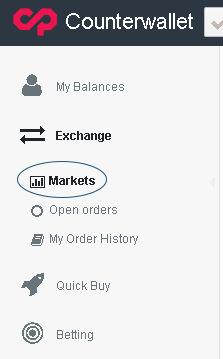

You will see the pairs with the most current activity. Clicking on these will forward you to their orderbook.

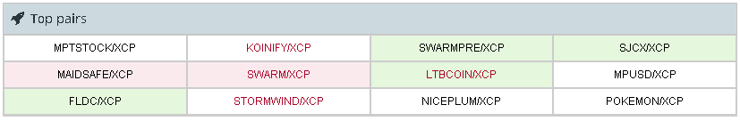

You can also specify a custom token to trade, if it does not appear in the top pairs list. 

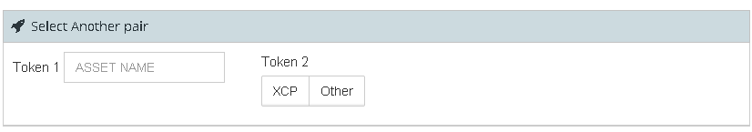

Simply write your token in the field (autocomplete will try to help) and click XCP or other. Most tokens are primarily traded against XCP, but you can trade absolutely any token. If you want to trade a token you have just created, you need have to wait until it has been verified by the Bitcoin blockchain first.)

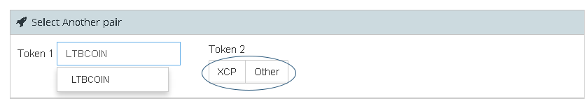

Then you will be able to see a graph showing the price and volume of that token (if there is enough data to display.)

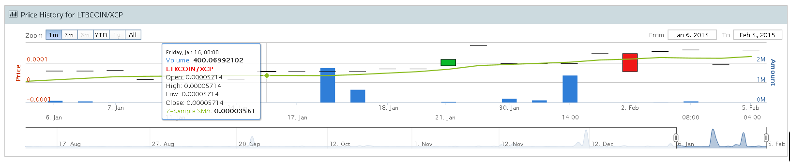

Using this interface you can choose which of your addresses you are using to trade, and place orders directly.

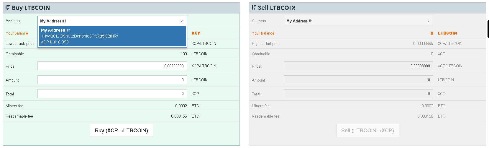

Below this interface, you can look at the current orderbook for that pair.

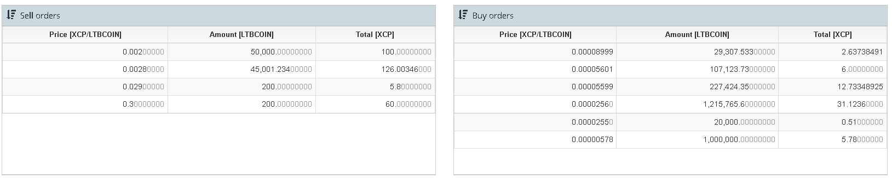

And below that is a listing of previously completed trades, if there are any.

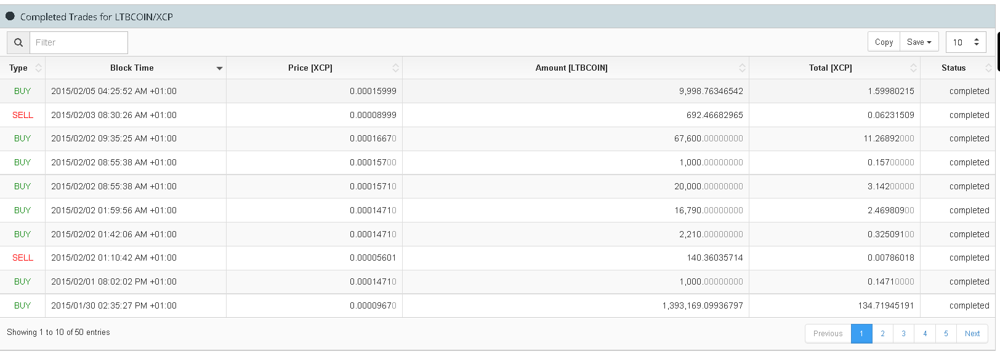

Let's try to buy 10 [LTBCOIN](http://ltbcoin.com/) just as an example. Set your desired price and amount, and press Buy.

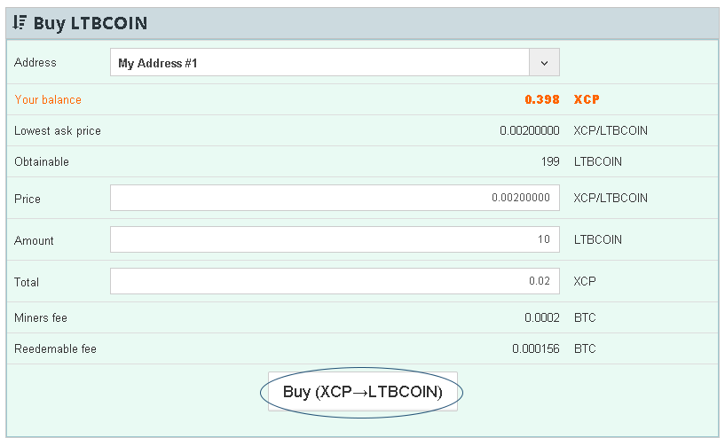

Counterwallet will ask you to confirm your order to make sure everything is correct.

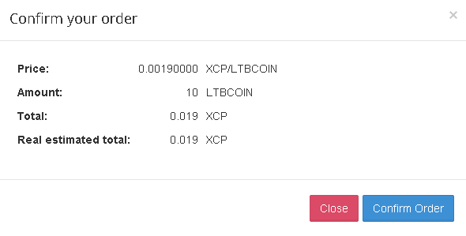

The order will now take some time to become valid and visible, while it is processed by the Bitcoin network.

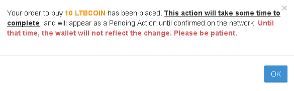

You will be able to see the pending order by clicking the clock in the top left of the screen.

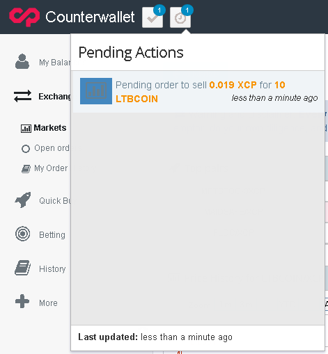

If you click the check to the left of the clock, you can see orders that have already been confirmed.

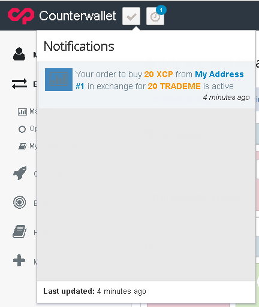

After a while, you will be able to see that the order confirmed. And if there is someone selling for the price that you are buying at, the order will be matched and completed automatically.

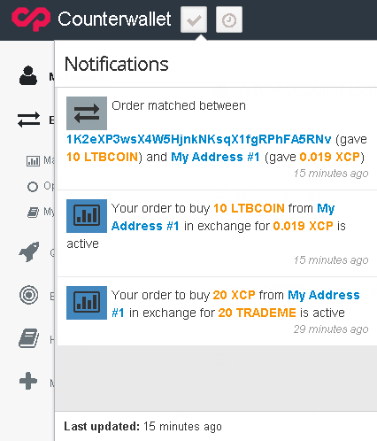

