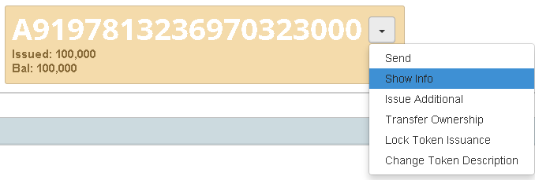
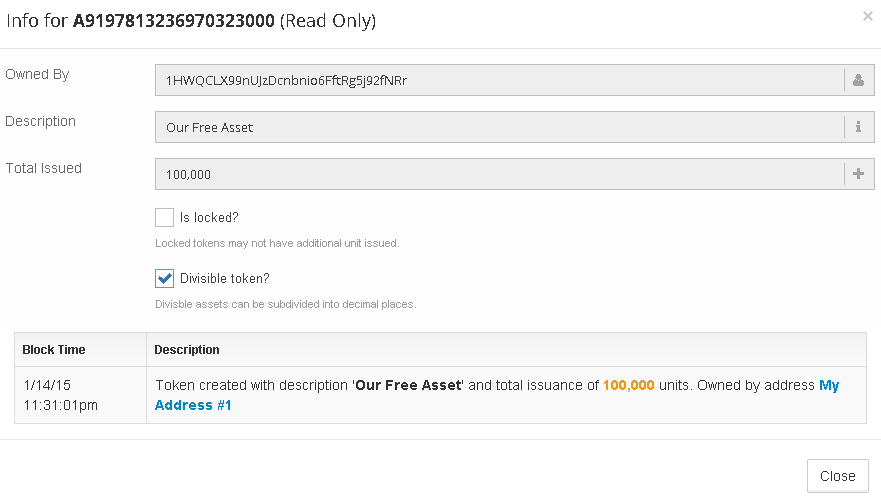
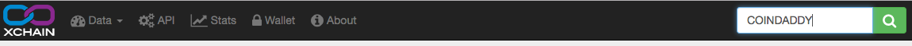
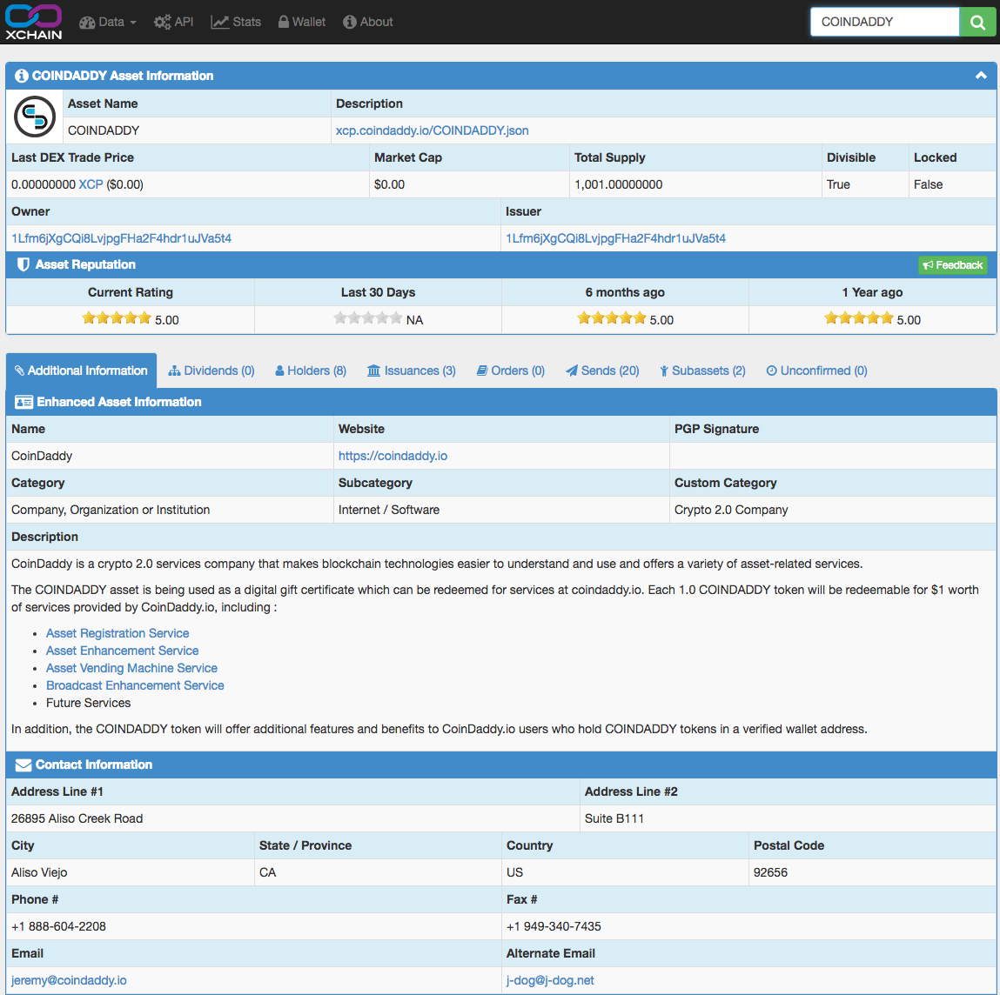

**Disclaimer:** All token information is provided by the creator and/or owner of the individual token and may not be accurate or up to date. Changing this information is an exclusive privilege of the address which owns the token on the blockchain. _All_ counterparty tokens are stored entirely in the Bitcoin blockchain and cannot be limited, restricted, or altered by anyone except their owner in any shape or form.

### Showing information about a token you already have

If you would like to learn more about a token you have, click on the down arrow in the token's box and then "Show Info".

You will then be able to see basic information about the token such as the description, total issuance, whether it is locked or divisible, and a brief history of the token.

### Showing information about any token

If you want to see the information of any token at all even if you are logged out, then you can use a [block explorer](https://xchain.io) to search for the token. 

Here you will find a full overview of the token, as well as its holders, dividends, updates and dex orders. 

In order to find out whether a token is legitimate, it is a good idea to check the comments section in the block explorer, the token's official website, and social media such as [Bitcointalk](http://bitcointalk.org).
