Counterwallet is an open-source web wallet for Bitcoin and Counterparty. It uses regular Bitcoin addresses, and lets you store Bitcoin, XCP, and user-created tokens without having to trust a server. What makes it different from many other web wallets, is that the _only_ possible way to access a wallet is by having access to the passphrase. In Counterwallet, none of your private information ever leaves your PC.

For extra security, Counterwallet also supports watch-only addresses, offline transaction signing, and [Armory](https://bitcoinarmory.com/). 

### Creating a Wallet

You can create as many wallets as you like.

Your account in Counterwallet is secured by a 12 word passphrase. In fact, this passphrase _is_ your wallet itself. Every word in this phrase represents a number. Your browser places this passphrase into a math equation and gets a list of Bitcoin addresses and private keys as the result. If the passphrase is the same, you can always calculate the same addresses and keys. You can do this even if Counterwallet is offline.

This means that your passphrase, your addresses and your private keys are never sent anywhere. This also makes it extremely important to keep your passphrase safe, as it cannot be restored by anyone. Please ensure that you have written it down correctly. Remember that once you close your browser, the only place this passphrase exists is the paper in your hand.

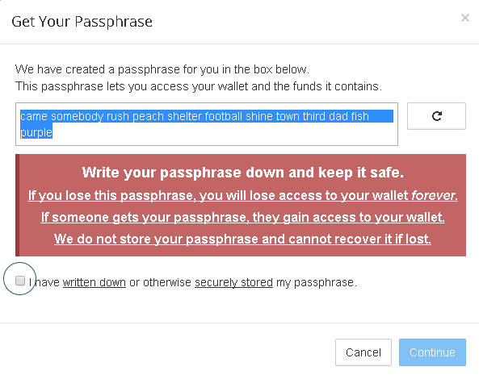

After you have written down your passphrase, the next dialog will give you an option to create a custom quick access URL. This will make it possible to access your wallet with a password of your choosing, by encrypting your passphrase as a link. This feature is best used for wallets with a low amount of funds that need to be accessed very frequently. When logging in with a quick URL, you will only need to enter your password (and can avoid writing the 12 word passphrase every time).

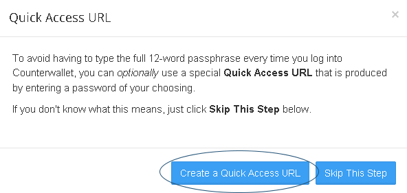

When you type a password, the URL will automatically adapt to be accessible for that password. Write the URL for your desired password down, and verify that it is correct by entering the same password again.

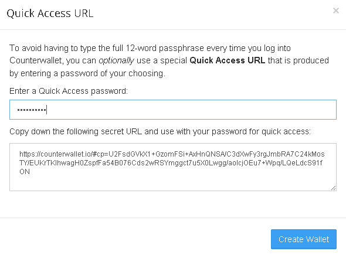

You can log in to your wallet by writing your passphrase, and pressing open wallet. The open wallet button will only become active once you have entered a valid passphrase.

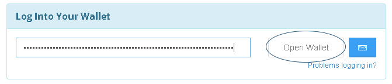

If this is your first time logging in, you will have to agree to the terms and conditions of service. Some features may not be permitted in your country or jurisdiction. U.S. users cannot use dividend or betting functionality by default, for example. This is not a technical limitation, and can be disabled if you run your own Counterwallet, but bare in mind that legal difficulties may arise. We hope that U.S. regulation will become more clear on this matter.

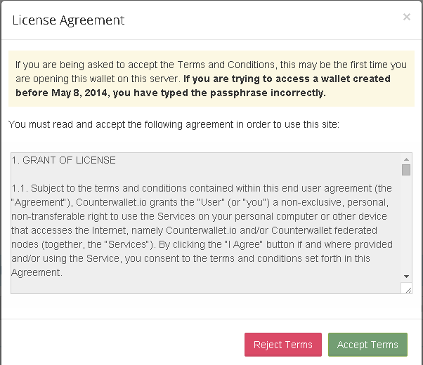

One important thing to know before getting started is that when you perform an action in Counterwallet (i.e. place an order, create a token, etc), it doesn't take effect immediately as it must first be confirmed on the Bitcoin blockchain. Counterwallet lets you know this by displaying your actions under the Pending Actions panel (the Clock icon on the top bar), and then moving them to the Notifications panel (the Checkbox icon) automatically once the network has successfully confirmed them. You'll also see the future expected value in parenthesis next to the current balance to better alert you that the change is pending. Note that depending on the speed at which blocks are solved, it could take anywhere from 2 to 40 minutes for your actions to be confirmed.

### Sending and receiving BTC, XCP, and user-created tokens

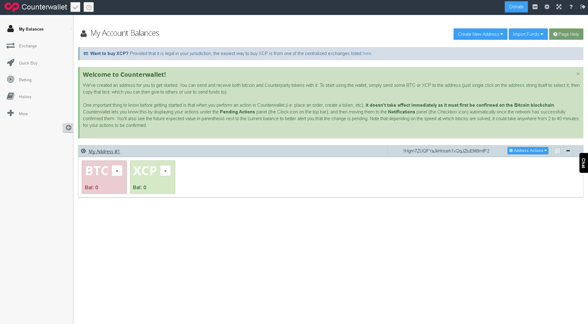

**One Bitcoin address will be automatically visible once you have created your wallet.** You can learn how to create more [here](create-addresses.md) and if you would like create an Armory address, you can read more about that [here](create-armory-addresses.md).

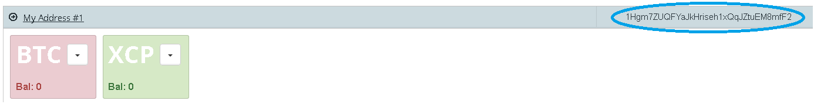

You can send and receive both bitcoin and Counterparty tokens with it. To start using the wallet, simply send some BTC or XCP to the address (just single click on the address string itself to select it, then copy that text, which you can then give to others or use to send funds to).

To send, click the down arrow button on BTC, XCP, or any user created token  to show the drop-down menu. Then click send.

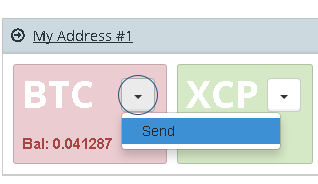

Enter the address you wish to send to, and your desired amount. The "MAX" button will send the entire balance of your sending address, minus the fees necessary for the transfer. Press send to sign and broadcast the transaction. The transfer will be complete once it is verified by the Bitcoin network.

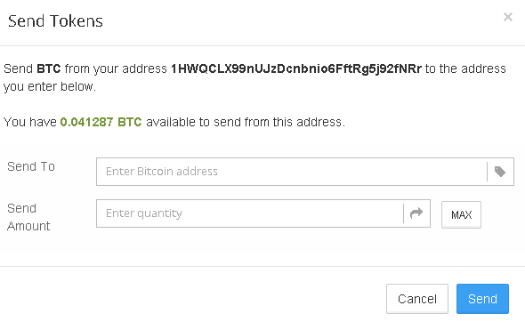

### Logging in without a keyboard (to avoid malware)

If you are worried about some form of malware reading your keyboard strokes, or cannot use a keyboard, it is possible to to use the on-screen keyboard to login. Simply click the blue keyboard icon to the right of the open wallet button.

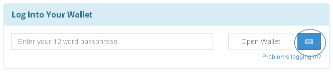

Then click on the text field of Word 1 to start typing. Note that this process is rather time consuming. Use it if you are worried or have reason to believe your computer has been compromised, and you need to move your coins.

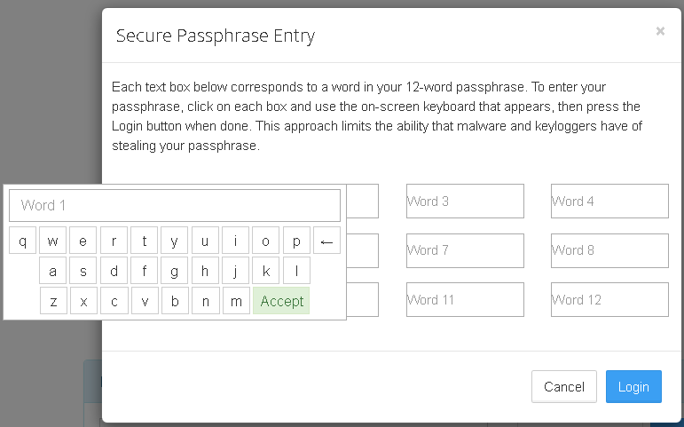

