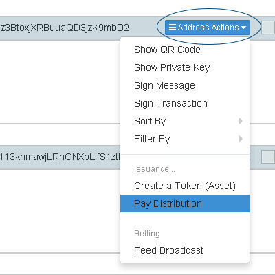
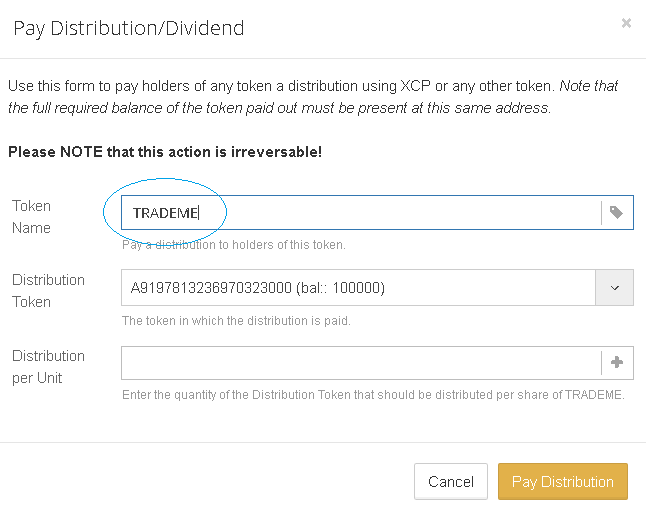
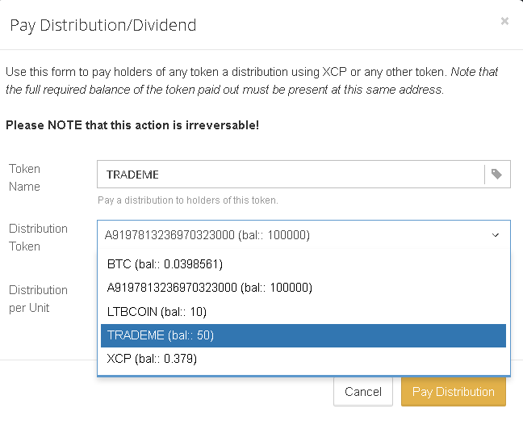
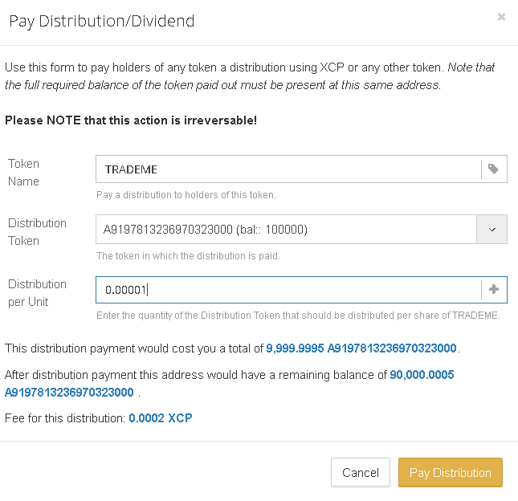

Counterparty natively supports payment distributions. This feature lets you distribute XCP, BTC or any other token to the holders of your own token. You can specify an amount per unit, and everyone who holds units of your own token will receive a proportional amount of the secondary token being distributed. Depending on the way it is used, this can also be referred to as 'dividend payments'. This feature has many clever uses, such as [transparent voting](voting.md).

**For example:**

1. You create a token TRADEME with 100 total units.
2. You sell 25 TRADEME to user A.
3. You sell 25 TRADEME to user B.
4. Now you have 50 TRADEME, while both users have 25 each.
5. Next, you make a distribution payment of 0.001 BTC per unit.
6. User A will receive 0.025 BTC
7. User B will receive 0.025 BTC

### BTC Distributions
It is possible to pay out distributions using Bitcoin directly. However, this process is a regular Bitcoin transaction without any extra added data (which would make it a Counterparty transaction). This means it will not be possible to distinguish it as a Counterparty type transaction on block explorers or inside Counterwallet. It will simply appear as a regular BTC transaction with multiple recipients.

Because this makes it difficult to distinguish distributions from regular transactions, we recommend that you use one address per asset, and do not use it for anything else. This will make it much easier to keep track of past BTC distributions. Otherwise it may be difficult for you and your users to get an overview of past distribution payments. 

### How to make a Distribution Payment in Counterwallet

Choose the address which owns the token you want to make a distribution payment on. 

**Click address actions, and "Pay Distribution".**

**Write the name of your token in the first field. You can only distribute funds to a token you have issued or control.**

**Specify the token to be distributed.**

**Specify the amount of the token to be distributed per unit ("_share_") and the costs will be displayed. Click "Pay Distribution" and after a while it will be confirmed by the Bitcoin network.**

**Once the distribution has been confirmed, you will be able to see it on a [block explorer](https://xchain.io). Note that you can only see XCP and asset distributions, while BTC distributions will be visible as BTC transactions.**

