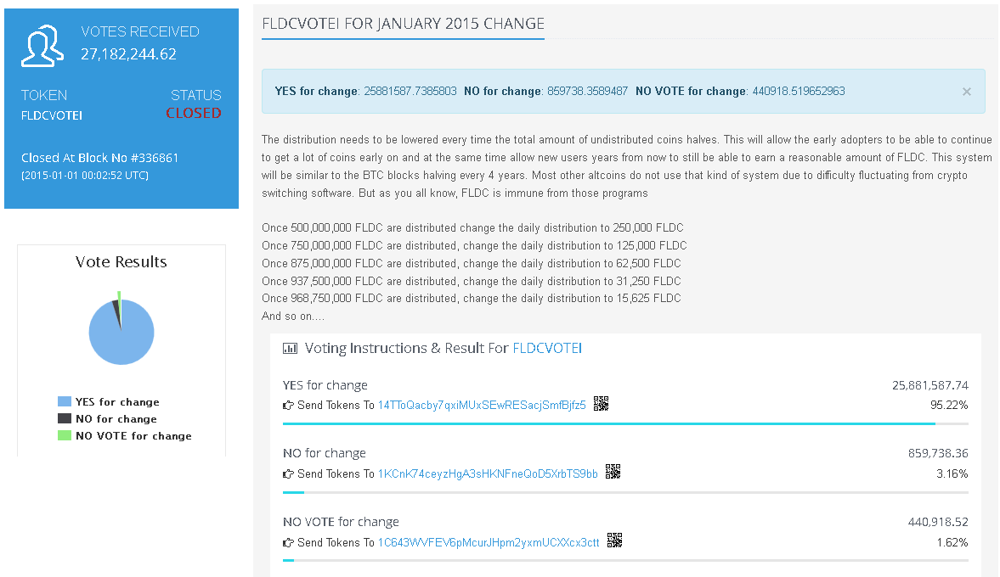

Counterparty supports voting through user-created tokens, as well as broadcasting information onto the Bitcoin blockchain. This means that you can post the terms and options of your vote as a broadcast, and let users vote on its outcome with full transparency by using tokens. 

If you create an token (‘EXAMPLE’), you can create any other tokens (such as EXAMPLEVOTE) and [pay distributions](pay-distribution.md) of EXAMPLEVOTE to all holders of EXAMPLE in one single action.

To send available votes to the holders of your asset, go to Counterwallet and click on your asset EXAMPLE, and then click pay distribution. Choose EXAMPLEVOTE as the currency to distribute. This way, all holders of EXAMPLE will receive EXAMPLEVOTE in the amount you specify.

Now all you need are as many different Bitcoin addresses as there are choices in your poll. To cast their votes, holders of EXAMPLE can then send the EXAMPLEVOTE they have received to whichever choice(s) they agree with. The results of the poll will be public and verifiable thanks to the Bitcoin blockchain.

**Example:**
* 10 users own the token "EXAMPLE".
* You make a distribution payment of EXAMPLEVOTE.
* Now each of the 10 users receives EXAMPLEVOTE proportionally to their holdings of EXAMPLE.
* You create a address for each option of the vote.
* You create a broadcast from the issuance address, describing the vote, the choices, and the addresses which represent the choices.

It may be a good idea to create burn addresses for this purpose (addresses where the private key is not known). This way, the votes cannot be recycled or moved. This can be done with a [simple python script](https://gist.github.com/CoinWhisperer/6d673f1f3d13da1611cd)

### Monitoring votes

If you want to get info about your votes, or other polls, you can use the voting page on the block explorer [Blockscan](http://blockscan.com/votes). 

**For [example](http://blockscan.com/vote/FLDCVOTEI):**

